

    

    <b style="font-size: 35px;">Iman</b>
     
    A daily companion for a Muslim

As a solo developer, I've crafted an enriching Islamic app that offers Quranic reading by page, juz, or verse, complete with Bangla and English translations. The app also provides features like prayer time management, insights into the Divine Names of Allah, a curated collection of Hadiths in both languages, a customizable Tasbih counter, and an efficient ayah search function. Additionally, I've implemented Hive for offline data storage, ensuring users can access their personalized Quranic content seamlessly.</b>.

    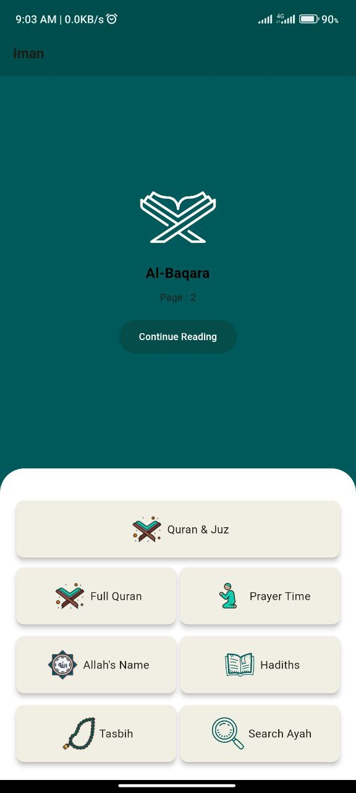
    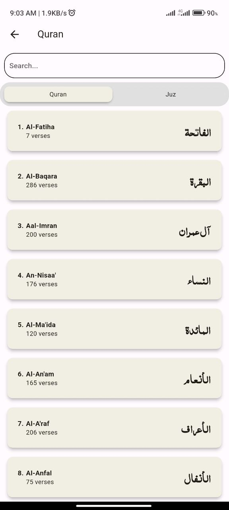
    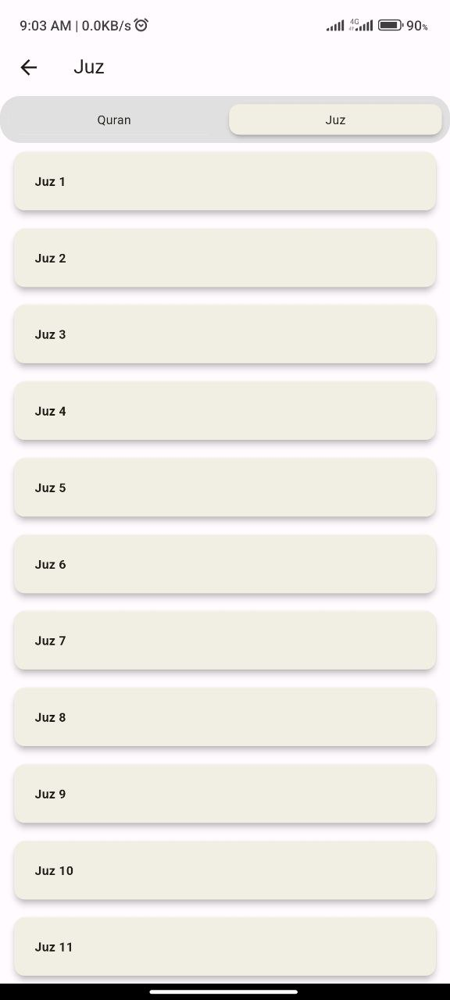

    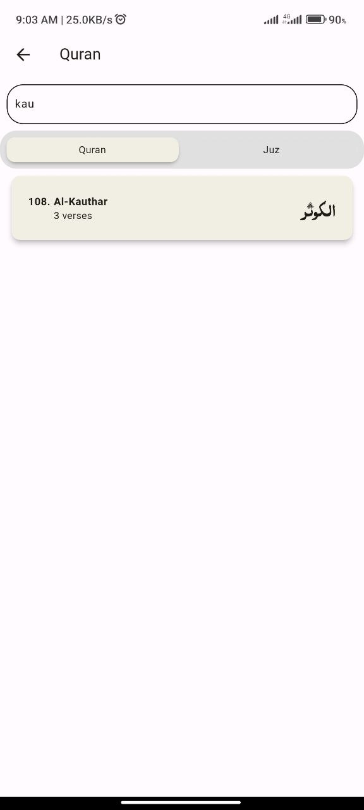
    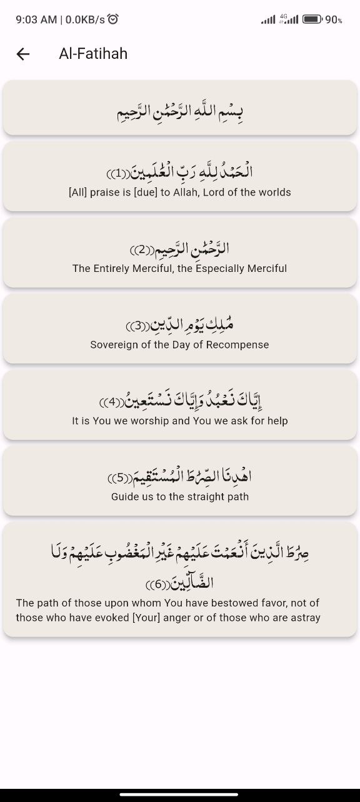
    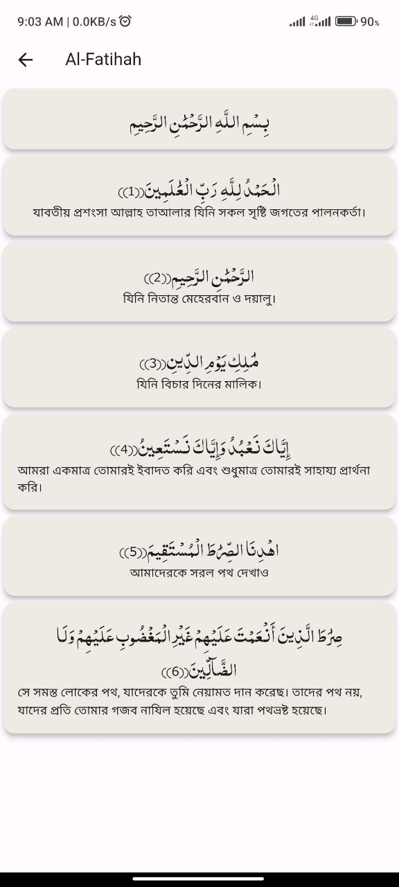

    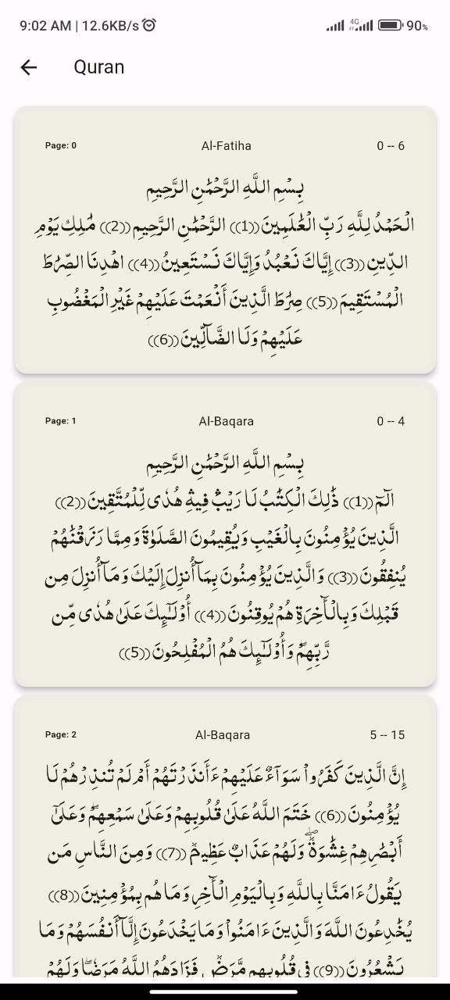
    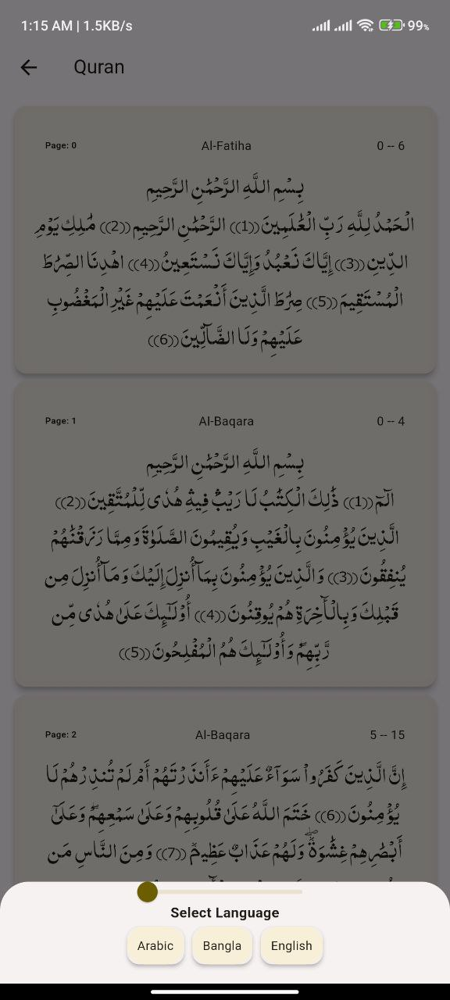
    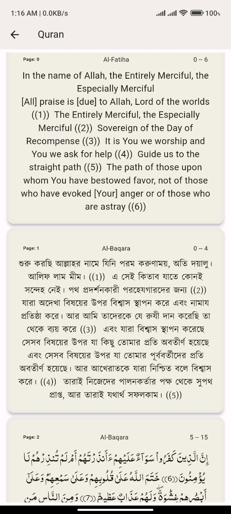

    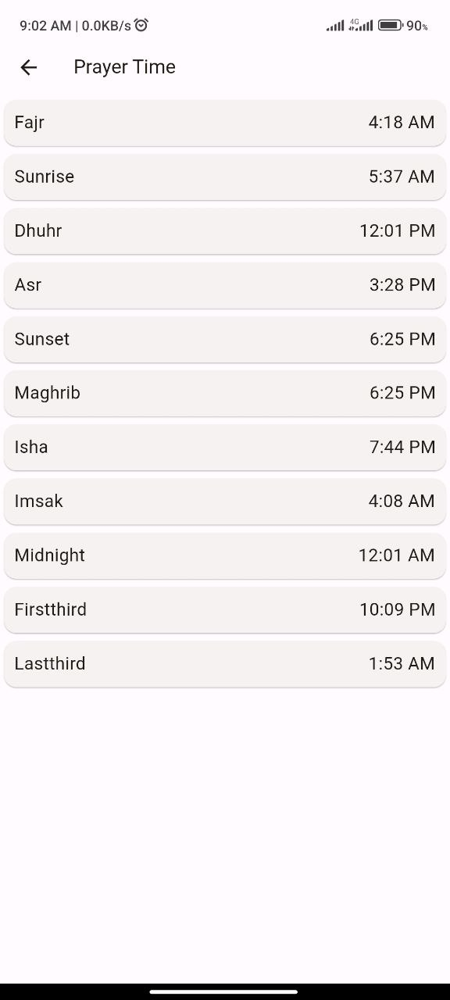
    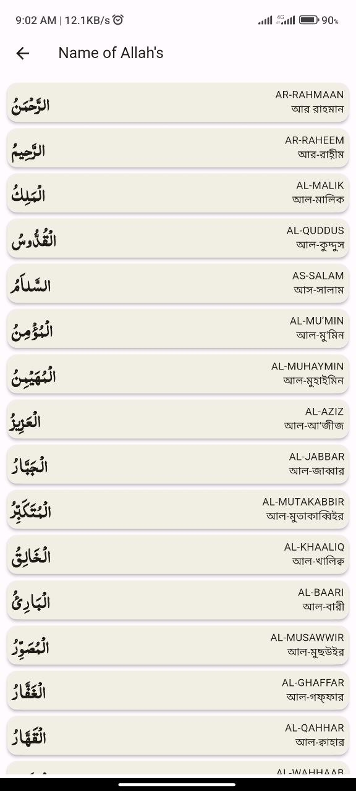
    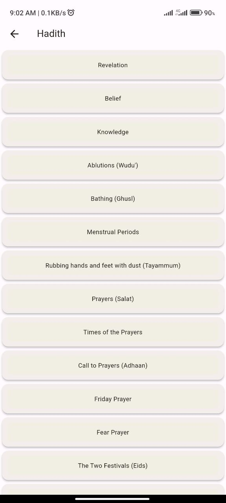

    
    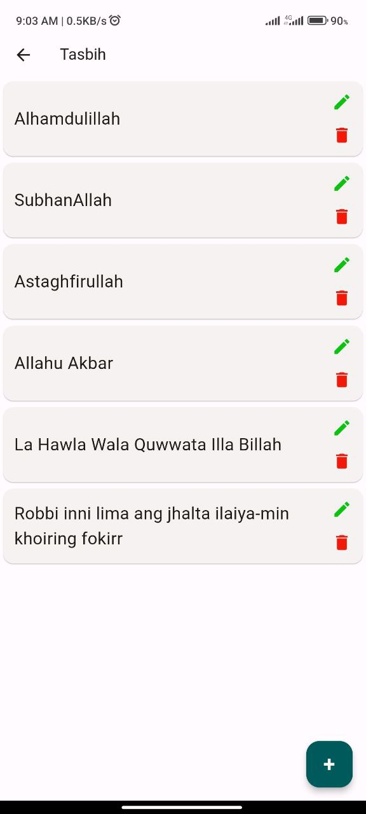
    

## Features

- **Quranic Verses Exploration**
- The app offers access to the Quran, allowing users to read it page by page, by juz, or even verse by verse. This feature enables a deep dive into the Quranic text.

- **Multi-language Quranic Translation:**
- In addition to the Quranic text, our app provides translations in both Bangla and English, enhancing comprehension and accessibility.

- **Prayer Time Management**
- Users can rely on the integrated prayer time functionality, ensuring they never miss their daily prayers while staying on schedule.

- **Names of Allah:**
- The app offers insights into the Divine Names of Allah, fostering a better understanding of His attributes and significance.

- **Hadith Collection**
- Explore a curated collection of Hadiths with translations in both Bangla and English, providing valuable knowledge of Islamic traditions.

- **Customizable Tasbih Counter**
- Engage in dhikr with ease using our Tasbih counter, which can be customized to suit individual preferences and counting needs.

- **Ayah Search**
- Quickly locate specific Quranic verses (ayahs) using the search functionality, making it effortless to find relevant content within the Quran.

[Download Iman](iman.apk)
